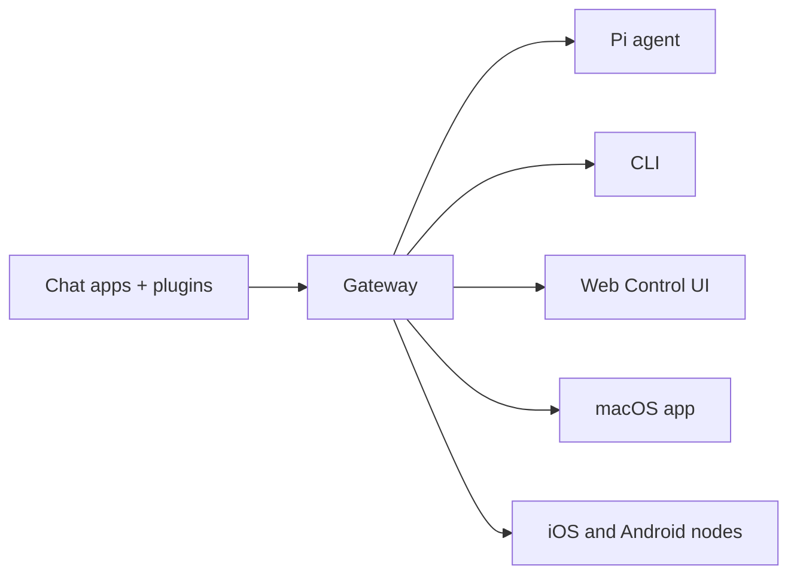

# OpenClaw 🦞

> _"EXFOLIATE! EXFOLIATE!"_ — A space lobster, probably

<p align="center"><strong>Any OS gateway for AI agents across WhatsApp, Telegram, Discord, iMessage, and more.</strong><br>Send a message, get an agent response from your pocket. Plugins add Mattermost and more.</p>

Install OpenClaw and bring up the Gateway in minutes. Guided setup with \`openclaw onboard\` and pairing flows. Launch the browser dashboard for chat, config, and sessions.

## What is OpenClaw?

OpenClaw is a **self-hosted gateway** that connects your favorite chat apps — WhatsApp, Telegram, Discord, iMessage, and more — to AI coding agents like Pi. You run a single Gateway process on your own machine (or a server), and it becomes the bridge between your messaging apps and an always-available AI assistant.

**Who is it for?** Developers and power users who want a personal AI assistant they can message from anywhere — without giving up control of their data or relying on a hosted service.

**What makes it different?**

* **Self-hosted**: runs on your hardware, your rules
* **Multi-channel**: one Gateway serves WhatsApp, Telegram, Discord, and more simultaneously
* **Agent-native**: built for coding agents with tool use, sessions, memory, and multi-agent routing
* **Open source**: MIT licensed, community-driven

**What do you need?** Node 22+, an API key (Anthropic recommended), and 5 minutes.

## How it works



The Gateway is the single source of truth for sessions, routing, and channel connections.

## Key capabilities

WhatsApp, Telegram, Discord, and iMessage with a single Gateway process. Add Mattermost and more with extension packages. Isolated sessions per agent, workspace, or sender. Send and receive images, audio, and documents. Browser dashboard for chat, config, sessions, and nodes. Pair iOS and Android nodes with Canvas support.

## Quick start

\`\`\`bash npm install -g openclaw@latest \`\`\` \`\`\`bash openclaw onboard --install-daemon \`\`\` \`\`\`bash openclaw channels login openclaw gateway --port 18789 \`\`\`

Need the full install and dev setup? See [Quick start](../start/quickstart/).

## Dashboard

Open the browser Control UI after the Gateway starts.

* Local default: [http://127.0.0.1:18789/](http://127.0.0.1:18789/)
* Remote access: [Web surfaces](../web/) and [Tailscale](../gateway/tailscale/)

<div align="center"></div>

## Configuration (optional)

Config lives at `~/.openclaw/openclaw.json`.

* If you **do nothing**, OpenClaw uses the bundled Pi binary in RPC mode with per-sender sessions.
* If you want to lock it down, start with `channels.whatsapp.allowFrom` and (for groups) mention rules.

Example:

```json5
{
  channels: {
    whatsapp: {
      allowFrom: ["+15555550123"],
      groups: { "*": { requireMention: true } },
    },
  },
  messages: { groupChat: { mentionPatterns: ["@openclaw"] } },
}
```

## Start here

All docs and guides, organized by use case. Core Gateway settings, tokens, and provider config. SSH and tailnet access patterns. Channel-specific setup for WhatsApp, Telegram, Discord, and more. iOS and Android nodes with pairing and Canvas. Common fixes and troubleshooting entry point.

## Learn more

Complete channel, routing, and media capabilities. Workspace isolation and per-agent sessions. Tokens, allowlists, and safety controls. Gateway diagnostics and common errors. Project origins, contributors, and license.
