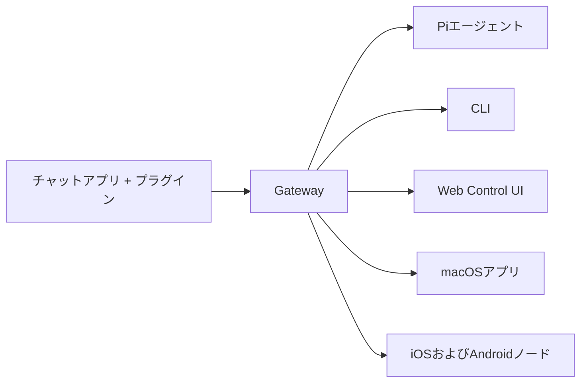

---
read_when:
  - 新規ユーザーにOpenClawを紹介するとき
summary: OpenClawは、あらゆるOSで動作するAIエージェント向けのマルチチャネルgatewayです。
title: OpenClaw
x-i18n:
  generated_at: '2026-02-08T17:15:47Z'
  model: claude-opus-4-5
  provider: pi
  source_hash: fc8babf7885ef91d526795051376d928599c4cf8aff75400138a0d7d9fa3b75f
  source_path: index.md
  workflow: 15
---

# OpenClaw 🦞

> _「EXFOLIATE! EXFOLIATE!」_ — たぶん宇宙ロブスター

<p align="center"><strong>WhatsApp、Telegram、Discord、iMessageなどに対応した、あらゆるOS向けのAIエージェントgateway。</strong><br>メッセージを送信すれば、ポケットからエージェントの応答を受け取れます。プラグインでMattermostなどを追加できます。</p>

OpenClawをインストールし、数分でGatewayを起動できます。 \`openclaw onboard\`とペアリングフローによるガイド付きセットアップ。 チャット、設定、セッション用のブラウザダッシュボードを起動します。

OpenClawは、単一のGatewayプロセスを通じてチャットアプリをPiのようなコーディングエージェントに接続します。OpenClawアシスタントを駆動し、ローカルまたはリモートのセットアップをサポートします。

## 仕組み



Gatewayは、セッション、ルーティング、チャネル接続の信頼できる唯一の情報源です。

## 主な機能

単一のGatewayプロセスでWhatsApp、Telegram、Discord、iMessageに対応。 拡張パッケージでMattermostなどを追加。 エージェント、ワークスペース、送信者ごとに分離されたセッション。 画像、音声、ドキュメントの送受信。 チャット、設定、セッション、ノード用のブラウザダッシュボード。 Canvas対応のiOSおよびAndroidノードをペアリング。

## クイックスタート

\`\`\`bash npm install -g openclaw@latest \`\`\` \`\`\`bash openclaw onboard --install-daemon \`\`\` \`\`\`bash openclaw channels login openclaw gateway --port 18789 \`\`\`

完全なインストールと開発セットアップが必要ですか？[クイックスタート](../../start/quickstart/)をご覧ください。

## ダッシュボード

Gatewayの起動後、ブラウザでControl UIを開きます。

* ローカルデフォルト: [http://127.0.0.1:18789/](http://127.0.0.1:18789/)
* リモートアクセス: [Webサーフェス](../../web/)および[Tailscale](../../gateway/tailscale/)

## 設定（オプション）

設定は`~/.openclaw/openclaw.json`にあります。

* **何もしなければ**、OpenClawはバンドルされたPiバイナリをRPCモードで使用し、送信者ごとのセッションを作成します。
* 制限を設けたい場合は、`channels.whatsapp.allowFrom`と（グループの場合）メンションルールから始めてください。

例：

```json5
{
  channels: {
    whatsapp: {
      allowFrom: ["+15555550123"],
      groups: { "*": { requireMention: true } },
    },
  },
  messages: { groupChat: { mentionPatterns: ["@openclaw"] } },
}
```

## ここから始める

ユースケース別に整理されたすべてのドキュメントとガイド。 Gatewayのコア設定、トークン、プロバイダー設定。 SSHおよびtailnetアクセスパターン。 WhatsApp、Telegram、Discordなどのチャネル固有のセットアップ。 ペアリングとCanvas対応のiOSおよびAndroidノード。 一般的な修正とトラブルシューティングのエントリーポイント。

## 詳細

チャネル、ルーティング、メディア機能の完全な一覧。 ワークスペースの分離とエージェントごとのセッション。 トークン、許可リスト、安全制御。 Gatewayの診断と一般的なエラー。 プロジェクトの起源、貢献者、ライセンス。
