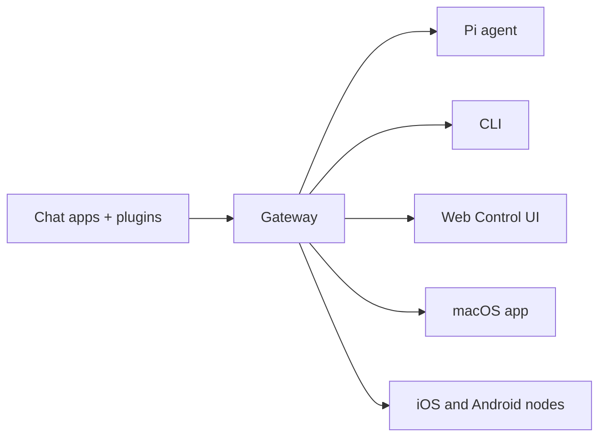

---
read_when:
  - 向新用户介绍 OpenClaw
summary: OpenClaw 是一个多渠道 AI 智能体 Gateway 网关，可在任何操作系统上运行。
title: OpenClaw
x-i18n:
  generated_at: '2026-02-04T17:53:40Z'
  model: claude-opus-4-5
  provider: pi
  source_hash: fc8babf7885ef91d526795051376d928599c4cf8aff75400138a0d7d9fa3b75f
  source_path: index.md
  workflow: 15
---

# OpenClaw 🦞

> _"去壳！去壳！"_ — 大概是一只太空龙虾说的

<p align="center"><strong>适用于任何操作系统的 AI 智能体 Gateway 网关，支持 WhatsApp、Telegram、Discord、iMessage 等。</strong><br>发送消息，随时随地获取智能体响应。通过插件可添加 Mattermost 等更多渠道。</p>

安装 OpenClaw 并在几分钟内启动 Gateway 网关。 通过 \`openclaw onboard\` 和配对流程进行引导式设置。 启动浏览器仪表板，管理聊天、配置和会话。

OpenClaw 通过单个 Gateway 网关进程将聊天应用连接到 Pi 等编程智能体。它为 OpenClaw 助手提供支持，并支持本地或远程部署。

## 工作原理



Gateway 网关是会话、路由和渠道连接的唯一事实来源。

## 核心功能

通过单个 Gateway 网关进程连接 WhatsApp、Telegram、Discord 和 iMessage。 通过扩展包添加 Mattermost 等更多渠道。 按智能体、工作区或发送者隔离会话。 发送和接收图片、音频和文档。 浏览器仪表板，用于聊天、配置、会话和节点管理。 配对 iOS 和 Android 节点，支持 Canvas。

## 快速开始

\`\`\`bash npm install -g openclaw@latest \`\`\` \`\`\`bash openclaw onboard --install-daemon \`\`\` \`\`\`bash openclaw channels login openclaw gateway --port 18789 \`\`\`

需要完整的安装和开发环境设置？请参阅[快速开始](../../start/quickstart/)。

## 仪表板

Gateway 网关启动后，打开浏览器控制界面。

* 本地默认地址：http://127.0.0.1:18789/
* 远程访问：[Web 界面](../../web/)和 [Tailscale](../../gateway/tailscale/)

## 配置（可选）

配置文件位于 `~/.openclaw/openclaw.json`。

* 如果你**不做任何修改**，OpenClaw 将使用内置的 Pi 二进制文件以 RPC 模式运行，并按发送者创建独立会话。
* 如果你想要限制访问，可以从 `channels.whatsapp.allowFrom` 和（针对群组的）提及规则开始配置。

示例：

```json5
{
  channels: {
    whatsapp: {
      allowFrom: ["+15555550123"],
      groups: { "*": { requireMention: true } },
    },
  },
  messages: { groupChat: { mentionPatterns: ["@openclaw"] } },
}
```

## 从这里开始

所有文档和指南，按用例分类。 核心 Gateway 网关设置、令牌和提供商配置。 SSH 和 tailnet 访问模式。 WhatsApp、Telegram、Discord 等渠道的具体设置。 iOS 和 Android 节点的配对与 Canvas 功能。 常见修复方法和故障排除入口。

## 了解更多

全部渠道、路由和媒体功能。 工作区隔离和按智能体的会话管理。 令牌、白名单和安全控制。 Gateway 网关诊断和常见错误。 项目起源、贡献者和许可证。
